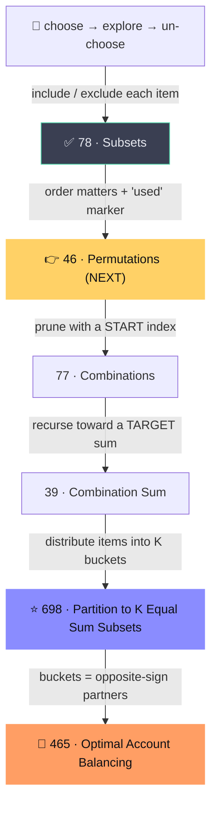

# Backtracking — Concept Map

One skeleton, learned one twist at a time. Each node is a problem; each **edge is the single twist** it adds over its parent.



## The template (write it the SAME way every time)
```python
def backtrack(start):           # 'start' = next item to place (often forced)
    if done():                  # base case → return 0 / True / record result
        return base
    best = INF                  # or res list / False / count
    for choice in choices(start):
        apply(choice)           # CHOOSE
        best = combine(best, backtrack(start + 1))   # EXPLORE
        undo(choice)            # UN-CHOOSE  ← the line everyone forgets
    return best
```
Fill three blanks: **base case · the choices · the prune.** Write *one honest level* and trust the recursion for the rest.

> Use this template even when a slicker one-off exists (bitmask subsets, etc.).
> The one-offs don't generalize; only this skeleton scales to 698 / 465. Same variable names every time = muscle memory.

## The twists, as ideas (one new concept per problem)
- **78 Subsets** ✅ — the base tree: take it / don't. `res.append(path[:])` (copy!), recurse `i+1`, `path.pop()`.
- **👉 46 Permutations** — *order matters.* Add a `used[]` marker; set it before recursing, clear it after (undo discipline).
- **77 Combinations** — *kill duplicates* with a `start` index so you only go forward. ← where "forced start" is born.
- **39 Combination Sum** — *recurse toward a target*; prune when remaining < 0.
- **⭐ 698 Partition to K Equal Sum Subsets** — *the keystone.* Fix next number → try each of K buckets → recurse → undo. Everything harder is a re-skin of this.
- **🎯 465 Optimal Account Balancing** — buckets form implicitly: fix first nonzero balance → settle against each opposite-sign partner → recurse → undo → min. Clean cancel = a zero-sum group closing. → [[optimal-account-balancing]]

## Tricks / gotchas
- **Copy on record:** `res.append(path[:])`, never `res.append(path)` — `path` is mutated in place.
- **Advance correctly:** recurse on `i+1` (continue past the item just taken), not `i` or `start+1`, in index-prune problems.
- **Always undo:** every `apply` needs a matching `undo` after the recursive call. Missing it = the #1 backtracking bug.
- **Forced `start`:** in partition problems you don't choose *which* item to place next — fix the first unplaced one. The only freedom is *which bucket/partner*. (Avoids redundant permutations.)
- **`combine` changes per problem:** collect (`res.append`), boolean (`any`), min-of-max, or `min(res, 1+...)`. Skeleton stays identical.

## Order to solve → 👉 NEXT before Optimal Balancing
`78 ✅ → 46 (next) → 77 → 39 → 698 ⭐ → 465 🎯`
**Do 46 Permutations now.** It's the smallest step up — adds only the `used` marker + undo.

See also: [[optimal-account-balancing]] · [[hierholzer-eulerian-path]]
